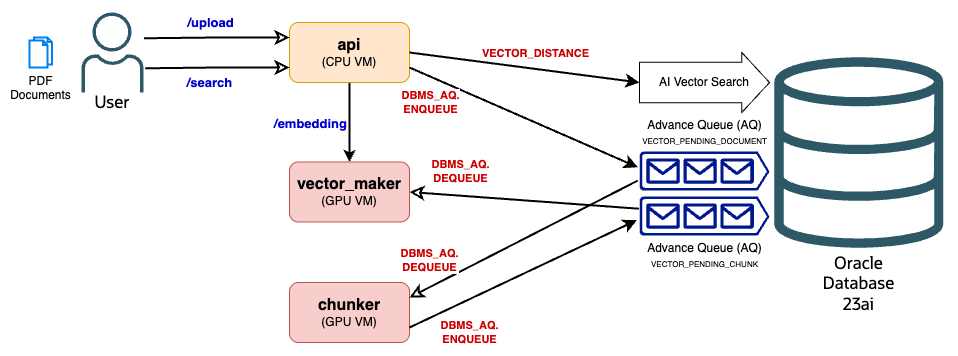

# Oracle AI Vector Search Benchmark

A microservices architecture for document processing, embedding generation, and vector similarity search using Oracle Database with AI Vector Search capabilities.

## Architecture



The system is split into three independent services:

### 1. API Service (`src/api_service/`)

- **Purpose**: Document upload and search
- **Port**: 8000 (default)
- **Endpoints**: `/upload`, `/search`, `/health`
- **Dependencies**: Flask, Oracle DB

### 2. Chunker Service (`src/chunker_service/`)

- **Purpose**: Document processing and text chunking
- **Port**: 8002 (default)
- **Endpoints**: `/health`, `/ready`
- **Dependencies**: Flask, Docling, Oracle DB
- **Features**: Background worker for queue processing, lightweight Docling configuration

### 3. Vector Maker Service (`src/vector_maker_service/`)

- **Purpose**: Embedding generation and queue processing
- **Port**: 8001 (default)
- **Endpoints**: `/embeddings`, `/health`
- **Dependencies**: Flask, vLLM, Oracle DB
- **Features**: Background worker for async processing

## System Flow

1. **Document Upload** → API Service stores documents and queues them for processing
2. **Document Processing** → Chunker Service processes documents from queue and creates text chunks
3. **Chunk Queuing** → Chunker Service queues chunks for embedding generation
4. **Embedding Generation** → Vector Maker Service generates embeddings for queued chunks
5. **Search** → API Service searches using generated embeddings

## Prerequisites

- Oracle Database 23ai with AI Vector Search
- Python 3.8+
- GPU with sufficient VRAM (for embedding model)
- Podman or Docker
- SQLcl

## Quick Start

### 1. Setup Environment and Database

```bash
# Clone repository
git clone https://github.com/vmleon/oracle-ai-vector-search-benchmark.git
cd oracle-ai-vector-search-benchmark

# Create virtual environment for setup scripts
python -m venv venv
source venv/bin/activate  # On Windows: venv\Scripts\activate
pip install -r requirements.txt

# Setup dataset and database
python local.py setup
python local.py run
```

This will download the dataset, start Oracle Database, and create required tables and queues.

### 2. Install Service Dependencies

**API Service:**

```bash
cd src/api_service
python -m venv venv
source venv/bin/activate  # On Windows: venv\Scripts\activate
pip install -r requirements.txt
```

**Chunker Service:**

```bash
cd src/chunker_service
python -m venv venv
source venv/bin/activate  # On Windows: venv\Scripts\activate
pip install -r requirements.txt
```

**Vector Maker Service:**

```bash
cd src/vector_maker_service
python -m venv venv
source venv/bin/activate  # On Windows: venv\Scripts\activate
pip install -r requirements.txt
```

### 3. Configure Environment

Create `.env` files in all service directories:

```bash
# Database Configuration (all services)
ORACLE_USER=SYSTEM
ORACLE_PASSWORD=your_password
ORACLE_HOST=localhost
ORACLE_PORT=1521
ORACLE_SERVICE_NAME=FREEPDB1

# API Service specific (.env in src/api_service/)
API_HOST=0.0.0.0
API_PORT=8000
API_MAX_FILE_SIZE=16777216

# Chunker Service specific (.env in src/chunker_service/)
CHUNKER_HOST=0.0.0.0
CHUNKER_PORT=8002
CHUNKER_CHUNK_SIZE=512
CHUNKER_CHUNK_OVERLAP=50
DOCUMENTS_STORAGE_PATH=../shared/documents

# Vector Maker Service specific (.env in src/vector_maker_service/)
VECTOR_HOST=0.0.0.0
VECTOR_PORT=8001
VECTOR_MODEL=intfloat/e5-mistral-7b-instruct
VECTOR_ENFORCE_EAGER=True
```

### 4. Run Services

**Start Vector Maker Service (first):**

```bash
cd src/vector_maker_service
source venv/bin/activate
python app.py
# or with gunicorn (recommended): gunicorn app:app -c gunicorn.conf.py
```

**Start Chunker Service:**

```bash
cd src/chunker_service
source venv/bin/activate
python app.py
# or with gunicorn (recommended): gunicorn app:app -c gunicorn.conf.py
```

**Start API Service:**

```bash
cd src/api_service
source venv/bin/activate
python app.py
# or with gunicorn (recommended): gunicorn app:app -c gunicorn.conf.py
```

## Usage Examples

### Upload Document

```bash
curl -X POST -F "file=@samples/document.pdf" http://localhost:8000/upload
```

### Search Documents

```bash
curl -X POST -H "Content-Type: application/json" \
  -d '{"query": "machine learning algorithms", "limit": 5}' \
  http://localhost:8000/search
```

### Generate Embeddings (Direct)

```bash
curl -X POST -H "Content-Type: application/json" \
  -d '{"texts": ["text to embed"]}' \
  http://localhost:8001/embeddings
```

### Health Checks

```bash
# API Service health
curl http://localhost:8000/health

# Chunker Service health
curl http://localhost:8002/health

# Vector Maker Service health
curl http://localhost:8001/health
```

## API Endpoints

- **API Service**: `/upload` (POST), `/search` (POST), `/health` (GET)
- **Vector Maker Service**: `/embeddings` (POST), `/health` (GET)  
- **Chunker Service**: `/health` (GET), `/ready` (GET)

*For detailed API documentation with request/response schemas, see individual service READMEs.*

## Database Schema

### Tables

- **documents**: Document metadata and file information
- **document_chunks**: Text chunks with vector embeddings

### Oracle Advanced Queues

- **VECTOR_PENDING_DOCUMENT**: Queue for documents awaiting chunking (processed by Chunker Service)
- **VECTOR_PENDING_CHUNK**: Queue for chunks awaiting embedding generation (processed by Vector Maker Service)

### Key Features

- Vector index on embeddings for fast similarity search
- SHA256-based file deduplication
- Automatic chunking with configurable overlap
- Connection pooling for optimal performance
- Liquibase-managed schema versioning and migrations

## Supported File Types

Multiple formats supported via Docling: PDF, DOCX, PPTX, HTML, TXT, MD

## Production Deployment

### Resource Requirements

- **API Service**: CPU-optimized, can scale horizontally
- **Chunker Service**: CPU-optimized, moderate memory for document processing
- **Vector Maker Service**: GPU with 14GB+ VRAM for embedding model
- **Database**: Oracle Database 23ai with sufficient storage for vectors

### Deployment Commands

**API Service:**

```bash
gunicorn app:app -c gunicorn.conf.py
```

**Chunker Service:**

```bash
gunicorn app:app -c gunicorn.conf.py
```

**Vector Maker Service:**

```bash
gunicorn app:app -c gunicorn.conf.py
```

### Monitoring

- Health endpoints for service status
- Comprehensive logging for debugging
- Database connection pool monitoring
- Queue depth monitoring for processing bottlenecks

## Performance Notes

- **API Service**: Horizontally scalable
- **Chunker/Vector Services**: Single worker recommended
- **Database**: Vector indexes for fast search
- Use provided `gunicorn.conf.py` for production settings

## Development

### Project Structure

```
src/
├── api_service/          # Document upload & search
├── chunker_service/      # Document processing & chunking  
├── vector_maker_service/ # Embedding generation
├── shared/documents/     # Document storage
└── liquibase/            # Database schema
```

### Architecture Principles

- Microservices with clear separation of concerns
- Independent deployment and scaling
- Queue-based async processing

## Cleanup

When finished:

```bash
python local.py cleanup
```

This stops the Oracle Database container and cleans up sample files.

## Contributing

Maintain service independence, add tests, and update documentation for changes.

## Troubleshooting

Common issues: GPU memory (14GB+ required), database connectivity, port conflicts (8000/8001/8002). Check service health endpoints and logs for debugging.

## License

This project is part of Oracle AI Vector Search benchmarking suite.
