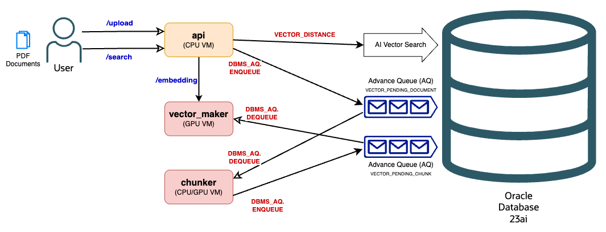

# Oracle AI Vector Search Benchmark

A microservices architecture for document processing, embedding generation, and vector similarity search using Oracle Database with AI Vector Search capabilities.

## Architecture



The system is split into two independent services:

### 1. API Service (`src/api_service/`)

- **Purpose**: Document upload, processing (chunking), and search
- **Port**: 8000 (default)
- **Endpoints**: `/upload`, `/search`, `/health`
- **Dependencies**: Flask, Docling, Oracle DB

### 2. Vector Maker Service (`src/vector_maker_service/`)

- **Purpose**: Embedding generation and queue processing
- **Port**: 8001 (default)
- **Endpoints**: `/embeddings`, `/health`
- **Dependencies**: Flask, vLLM, Oracle DB
- **Features**: Background worker for async processing

## System Flow

1. **Document Upload** → API Service processes and chunks documents
2. **Queue Enqueue** → Chunks are queued for embedding generation
3. **Background Processing** → Vector Maker Service generates embeddings
4. **Search** → API Service searches using generated embeddings

## Prerequisites

- Oracle Database 23ai with AI Vector Search
- Python 3.8+
- GPU with sufficient VRAM (for embedding model)
- Podman or Docker
- SQLcl

## Quick Start

### 1. Setup Environment and Database

```bash
# Clone repository
git clone https://github.com/vmleon/oracle-ai-vector-search-benchmark.git
cd oracle-ai-vector-search-benchmark

# Create virtual environment for setup scripts
python -m venv venv
source venv/bin/activate  # On Windows: venv\Scripts\activate
pip install -r requirements.txt

# Setup dataset and database
python local.py setup
python local.py run
```

This will download the dataset, start Oracle Database, and create required tables and queues.

### 2. Install Service Dependencies

**API Service:**

```bash
cd src/api_service
python -m venv venv
source venv/bin/activate  # On Windows: venv\Scripts\activate
pip install -r requirements.txt
```

**Vector Maker Service:**

```bash
cd src/vector_maker_service
python -m venv venv
source venv/bin/activate  # On Windows: venv\Scripts\activate
pip install -r requirements.txt
```

### 3. Configure Environment

Create `.env` files in both service directories:

```bash
# Database Configuration (both services)
ORACLE_USER=SYSTEM
ORACLE_PASSWORD=your_password
ORACLE_HOST=localhost
ORACLE_PORT=1521
ORACLE_SERVICE_NAME=FREEPDB1

# API Service specific (.env in src/api_service/)
API_HOST=0.0.0.0
API_PORT=8000
API_MAX_FILE_SIZE=16777216
API_CHUNK_SIZE=512
API_CHUNK_OVERLAP=50

# Vector Maker Service specific (.env in src/vector_maker_service/)
VECTOR_HOST=0.0.0.0
VECTOR_PORT=8001
VECTOR_MODEL=intfloat/e5-mistral-7b-instruct
VECTOR_ENFORCE_EAGER=True
```

### 4. Run Services

**Start Vector Maker Service (first):**

```bash
cd src/vector_maker_service
source venv/bin/activate
python app.py
# or with gunicorn (recommended): gunicorn app:app -c gunicorn.conf.py
```

**Start API Service:**

```bash
cd src/api_service
source venv/bin/activate
python app.py
# or with gunicorn (recommended): gunicorn app:app -c gunicorn.conf.py
```

## Usage Examples

### Upload Document

```bash
curl -X POST -F "file=@samples/document.pdf" http://localhost:8000/upload
```

### Search Documents

```bash
curl -X POST -H "Content-Type: application/json" \
  -d '{"query": "machine learning algorithms", "limit": 5}' \
  http://localhost:8000/search
```

### Generate Embeddings (Direct)

```bash
curl -X POST -H "Content-Type: application/json" \
  -d '{"texts": ["text to embed"]}' \
  http://localhost:8001/embeddings
```

### Health Checks

```bash
# API Service health
curl http://localhost:8000/health

# Vector Maker Service health
curl http://localhost:8001/health
```

## API Reference

### API Service Endpoints

#### POST /upload

Upload and process documents with automatic chunking and queuing.

**Response:**

```json
{
  "document_id": 123,
  "filename": "document.pdf",
  "title": "Document Title",
  "page_count": 10,
  "chunks_count": 25,
  "file_hash": "sha256_hash",
  "message": "Document processed and queued for embedding generation"
}
```

#### POST /search

Vector similarity search across processed documents.

**Request:**

```json
{
  "query": "search text",
  "limit": 10,
  "similarity_threshold": 0.7
}
```

**Response:**

```json
{
  "query": "search text",
  "results_count": 3,
  "results": [
    {
      "text": "matching chunk text...",
      "filename": "document.pdf",
      "title": "Document Title",
      "chunk_index": 2,
      "similarity": 0.85
    }
  ]
}
```

### Vector Maker Service Endpoints

#### POST /embeddings

Generate embeddings for text arrays.

**Request:**

```json
{
  "texts": ["text 1", "text 2"]
}
```

**Response:**

```json
{
  "embeddings": [
    {
      "text": "text 1",
      "embedding": [0.1, 0.2, 0.3, ...],
      "size": 4096
    }
  ]
}
```

## Database Schema

### Tables

- **documents**: Document metadata and file information
- **document_chunks**: Text chunks with vector embeddings
- **AQ$\_JMS_VECTOR_PENDING_CHUNK**: Oracle Advanced Queue for async processing

### Key Features

- Vector index on embeddings for fast similarity search
- SHA256-based file deduplication
- Automatic chunking with configurable overlap
- Connection pooling for optimal performance
- Liquibase-managed schema versioning and migrations

## Supported File Types

Via Docling document processing:

- PDF files
- Word documents (.docx)
- PowerPoint presentations (.pptx)
- HTML files
- Text files (.txt)
- Markdown files (.md)

## Production Deployment

### Resource Requirements

- **API Service**: CPU-optimized, can scale horizontally
- **Vector Maker Service**: GPU with 14GB+ VRAM for embedding model
- **Database**: Oracle Database 23ai with sufficient storage for vectors

### Deployment Commands

**API Service with Gunicorn:**

```bash
# Using configuration file (recommended)
gunicorn app:app -c gunicorn.conf.py

# Or manual settings
gunicorn app:app -b 0.0.0.0:8000 -w 2 --timeout 300 --max-requests 100
```

**Vector Maker Service with Gunicorn:**

```bash
# Using configuration file (recommended)  
gunicorn app:app -c gunicorn.conf.py

# Or manual settings
gunicorn app:app -b 0.0.0.0:8001 -w 1 --timeout 600 --max-requests 50
```

### Monitoring

- Health endpoints for service status
- Comprehensive logging for debugging
- Database connection pool monitoring
- Queue depth monitoring for processing bottlenecks

## Performance Considerations

- **API Service**: Stateless, horizontally scalable
- **Vector Maker Service**: Single worker recommended for GPU usage
- **Database**: Use vector indexes for optimal search performance
- **Queue**: Monitor processing rate to avoid backlogs
- **Gunicorn Configuration**: Use provided `gunicorn.conf.py` files for optimized production settings
- **Memory Management**: Configuration files include automatic worker recycling to prevent memory leaks

## Development

### Project Structure

```
src/
├── api_service/          # Document upload & search service
│   ├── api/              # Flask routes
│   ├── database/         # Database operations
│   ├── services/         # Business logic
│   └── requirements.txt  # Service dependencies
├── vector_maker_service/ # Embedding generation service
│   ├── api/              # Flask routes
│   ├── database/         # Database operations
│   ├── models/           # ML model management
│   ├── services/         # Business logic
│   └── requirements.txt  # Service dependencies
└── liquibase/            # Database schema management
    ├── changelog/        # Database change scripts
    └── liquibase.properties
```

### Clean Code Principles

- Independent, deployable services
- Minimal dependencies per service
- Clear separation of concerns
- Comprehensive error handling
- Detailed logging and monitoring

## Cleanup

When finished:

```bash
python local.py cleanup
```

This stops the Oracle Database container and cleans up sample files.

## Contributing

1. Follow clean, simple code principles
2. Maintain service independence
3. Add tests for new functionality
4. Update documentation for changes
5. Ensure both services remain independently deployable

## Troubleshooting

### Common Issues

1. **Model Loading**: Vector Maker Service requires time to load embedding model
2. **GPU Memory**: Ensure sufficient VRAM (14GB+) for embedding model
3. **Database Connection**: Verify Oracle credentials and connectivity
4. **Queue Processing**: Check Oracle AQ configuration and permissions
5. **Port Conflicts**: Ensure ports 8000 and 8001 are available

### Useful Commands

```bash
# Check service health
curl http://localhost:8000/health
curl http://localhost:8001/health

# View service logs
tail -f api_service.log
tail -f vector_maker_service.log

# Check database connectivity
sqlcl SYSTEM/password@localhost:1521/FREEPDB1
```

## License

This project is part of Oracle AI Vector Search benchmarking suite.
